# ZenFlow Mobile (Flutter)

A cross-platform mobile workspace engineered for the ZenFlow productivity and finance ecosystem, built with Flutter and BLoC architecture for iOS and Android.

---

## Overview

ZenFlow Mobile provides a unified on-the-go experience for managing daily tasks, tracking multi-currency personal expenses, visualizing spending analytics, and scheduling calendar events. Built to operate in real-time synchronization with the ZenFlow web dashboard and Django backend, it combines native mobile capabilities with a refined glassmorphic design system.

---

## User Interface Showcase

### 1. Core Workspace

| Dashboard Overview | Task Management | Calendar & Schedule |
| :---: | :---: | :---: |
| 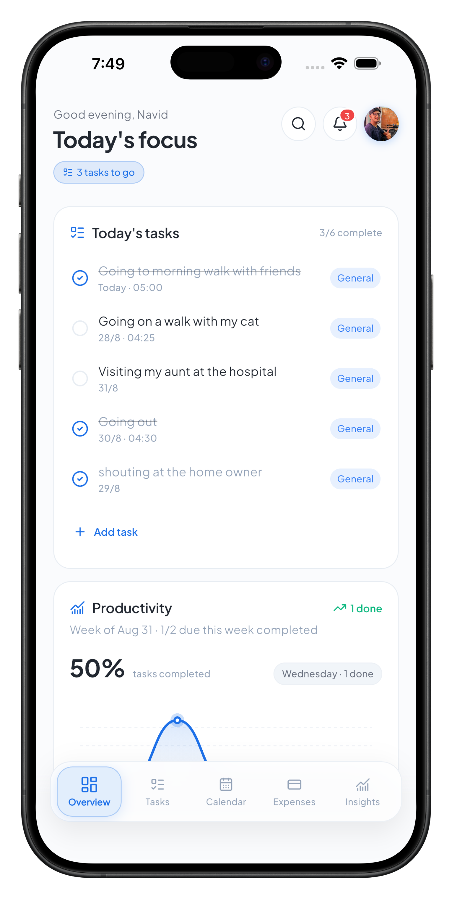 | 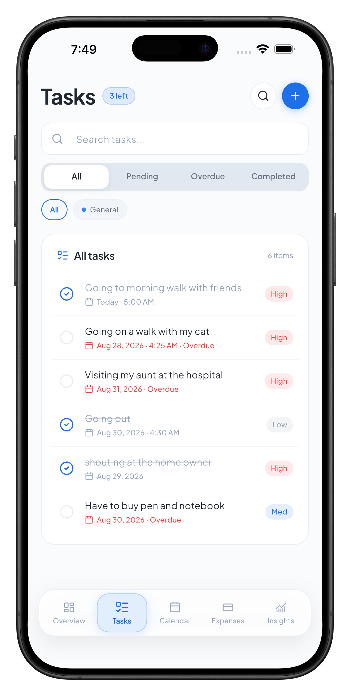 | 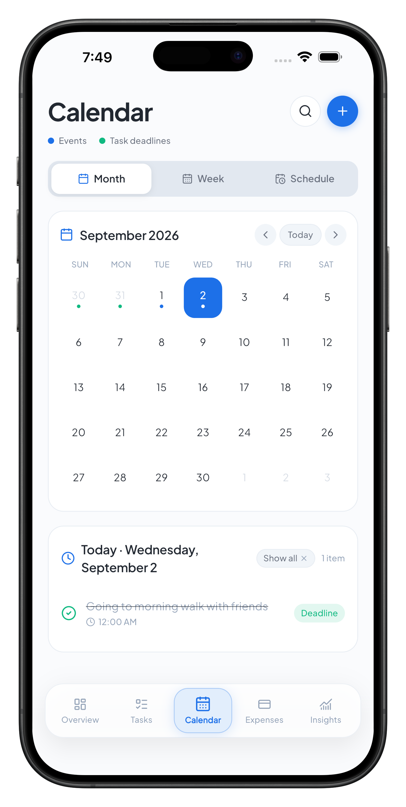 |
| Daily focus, task counters, productivity charts, and floating bottom navigation. | Priority tags, status filters, search, and quick completion. | Monthly calendar grid, daily agendas, and event deadline markers. |

---

### 2. Expenses & Budget Management

| Expenses Tracker | Budget & Category Limits | Spending Analytics |
| :---: | :---: | :---: |
| 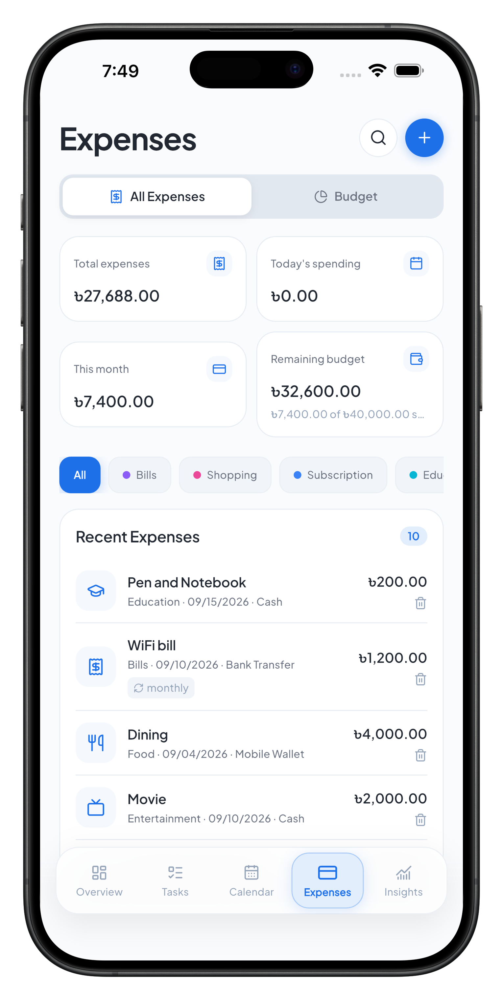 | 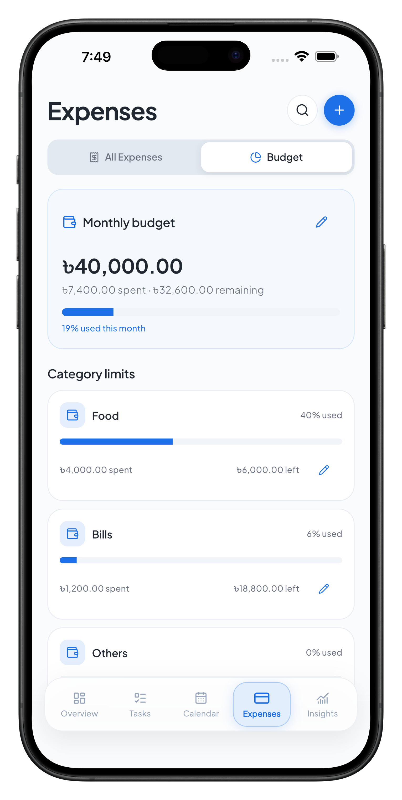 | 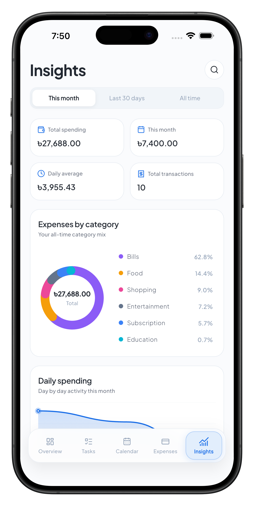 |
| Multi-currency expense balances, category tags, and transaction feeds. | Monthly spending gauges and interactive category limit adjustments. | Distribution donut chart, daily spending averages, and volume counts. |

---

### 3. Analytics & Insights

| Spending Trends | Smart Analytics & Health | Notification Center |
| :---: | :---: | :---: |
| 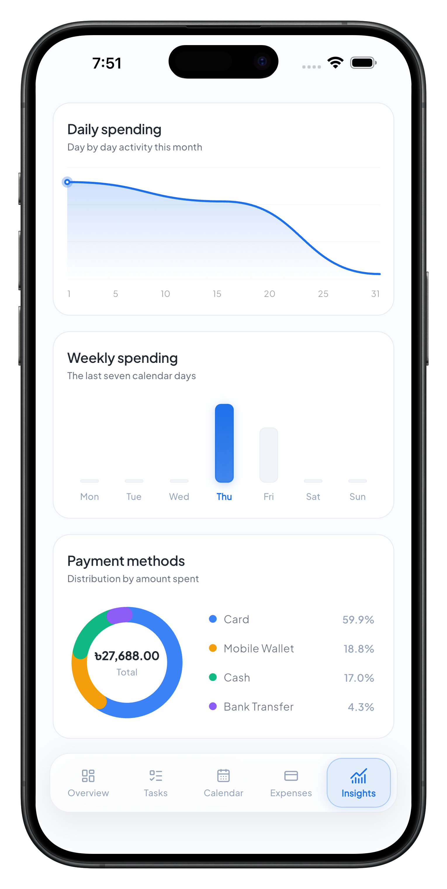 | 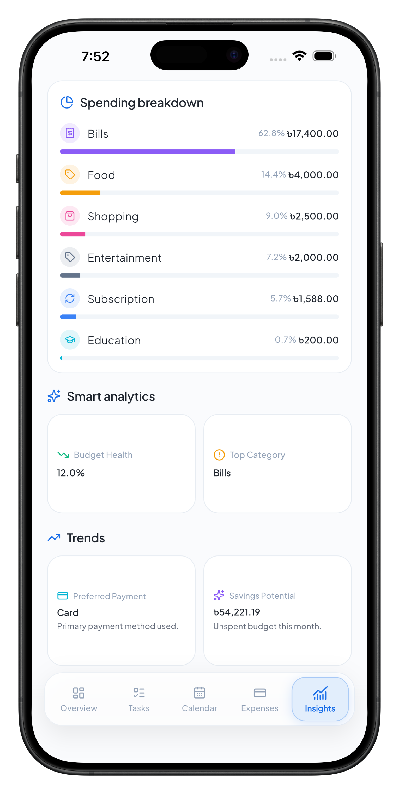 | 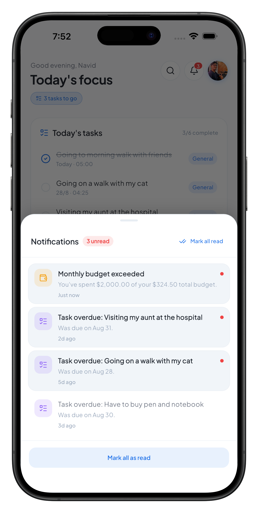 |
| Daily wave curves, weekly bar charts, and payment method mixes. | Budget health score, category breakdown, and savings potential. | Unread badge counters, budget threshold warnings, and overdue reminders. |

---

### 4. Profile, Themes & Preferences

| User Profile | Appearance & Themes | Notification Preferences |
| :---: | :---: | :---: |
| 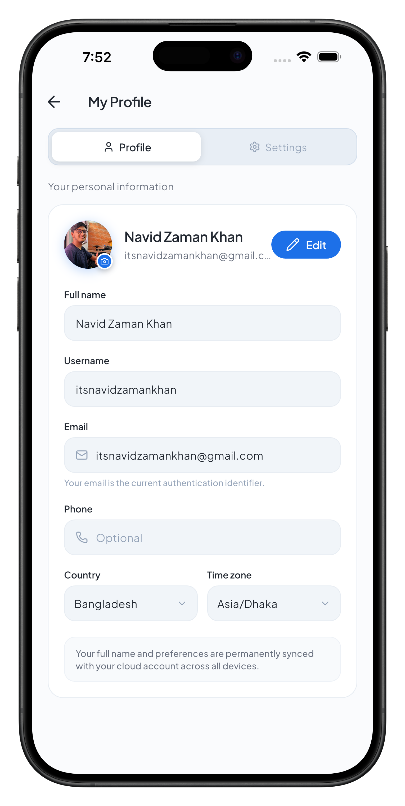 | 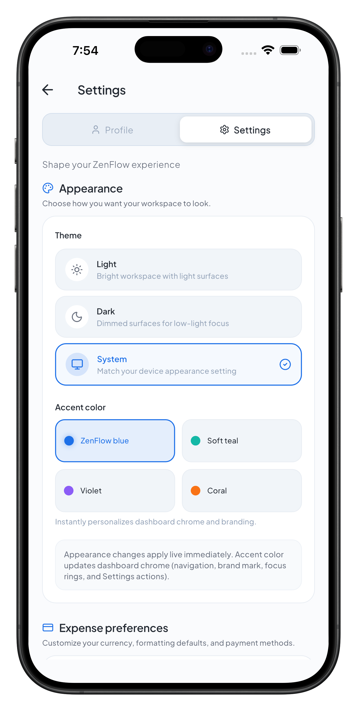 | 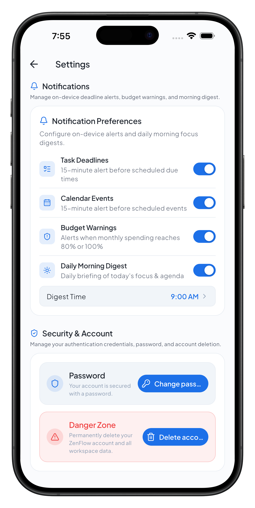 |
| Camera and gallery photo picker, bidirectional cloud avatar sync. | System, Light, and Dark modes with four curated accent palettes. | Task deadline alerts, budget threshold controls, and morning digest scheduler. |

---

## Core Capabilities

### Task & Schedule Management
* Unified Task Lifecycle: Create, prioritize (High, Medium, Low), filter by status (All, Pending, Overdue, Completed), and categorize items.
* Interactive Calendar: Multi-mode calendar view (Month, Week, Schedule) synchronized with real-time task deadlines and standalone calendar events.
* Global Search: Instant full-text search across tasks, events, and expense records with category filtering.

### Expense Tracking & Precision Multi-Currency Engine
* Multi-Currency Support: Real-time conversion across 8 international currencies (USD, EUR, GBP, BDT, INR, CAD, AUD, JPY).
* Rounding Precision: Algorithmic step-snapping heuristic to eliminate floating-point drift during currency switches.
* Interactive Budget Controls: Configurable monthly budgets with individual category allocations and visual warning thresholds (80% and 100%).

### Native Mobile Integrations
* Camera & Photo Picker: Native image picker with automatic multipart image compression and cloud sync via `PATCH /api/auth/me/`.
* Background Local Notifications: Timezone-aware local alarm scheduler for 15-minute deadline reminders, threshold breaches, and customizable daily morning digests.
* Haptic Feedback: Tactile response on button taps, toggle switches, filter selections, and pull-to-refresh gestures.
* Encrypted Storage: Biometric-ready secure key-value token persistence via Keychain (iOS) and KeyStore (Android).

---

## Technical Architecture

```text
lib/
├── core/
│   ├── constants/            # API endpoints, asset keys, and app configurations
│   ├── network/              # Dio HTTP client, auth interceptors, and error handling
│   ├── services/             # Currency engine, Google OAuth, and Local Notification daemon
│   ├── theme/                # ZenFlow color tokens, typography scale, and ThemeBloc
│   └── widgets/              # Reusable UI primitives (ZenAvatar, ZenCard, ZenButton)
├── features/
│   ├── auth/                 # Authentication BLoC, login, registration, OTP, and AuthGate
│   ├── calendar/             # Calendar views, event scheduling, and agenda lists
│   ├── dashboard/            # Shell navigation, floating glassmorphic bar, and overview metrics
│   ├── expenses/             # Expense logging, category budgets, and bottom sheets
│   ├── insights/             # Donut charts, spending curves, and analytics data models
│   ├── notifications/        # Local notification models, preference storage, and sheets
│   ├── profile/              # User profile BLoC, photo upload, theme settings, and security
│   ├── search/               # Global multi-domain search engine and bottom sheet
│   └── tasks/                # Task management BLoC, filter chips, and creation dialogs
└── main.dart                 # Application entrypoint and root MultiBlocProvider
```

---

## Technology Stack

* Framework: Flutter 3.47+ / Dart 3.13+
* State Management: `flutter_bloc` 9.1+, `equatable` 2.1+
* Networking: `dio` 5.11+
* Local Notifications: `flutter_local_notifications` 18.0+, `timezone` 0.10+
* Image & Media Handling: `image_picker` 1.1+, `cached_network_image` 3.4+
* Secure Storage: `flutter_secure_storage` 9.2+
* Typography & Icons: `google_fonts` (Plus Jakarta Sans), `flutter_lucide`

---

## Getting Started

### Prerequisites

* Flutter SDK (3.47.0 or higher)
* Xcode 15+ (for iOS Simulator and physical device deployment)
* Android Studio / Android SDK (API 23+)
* CocoaPods 1.14+

### Installation & Run

1. Clone the repository:
```bash
git clone https://github.com/NavidZamanKhan/ZenFlow-Flutter.git
cd ZenFlow-Flutter
```

2. Install dependencies:
```bash
flutter pub get
```

3. Run static analysis and unit tests:
```bash
flutter analyze
flutter test
```

4. Launch the application:
```bash
flutter run
```

---

## Backend & Web Ecosystem

* Web Application: Next.js 14, Tailwind CSS, TypeScript
* Backend API: Django 5.0, Django REST Framework, SimpleJWT, PostgreSQL
* Hosting & Infrastructure: Render (Backend API), Supabase (Database), Vercel (Web Platform)

---

## License

Private and proprietary. All rights reserved.
